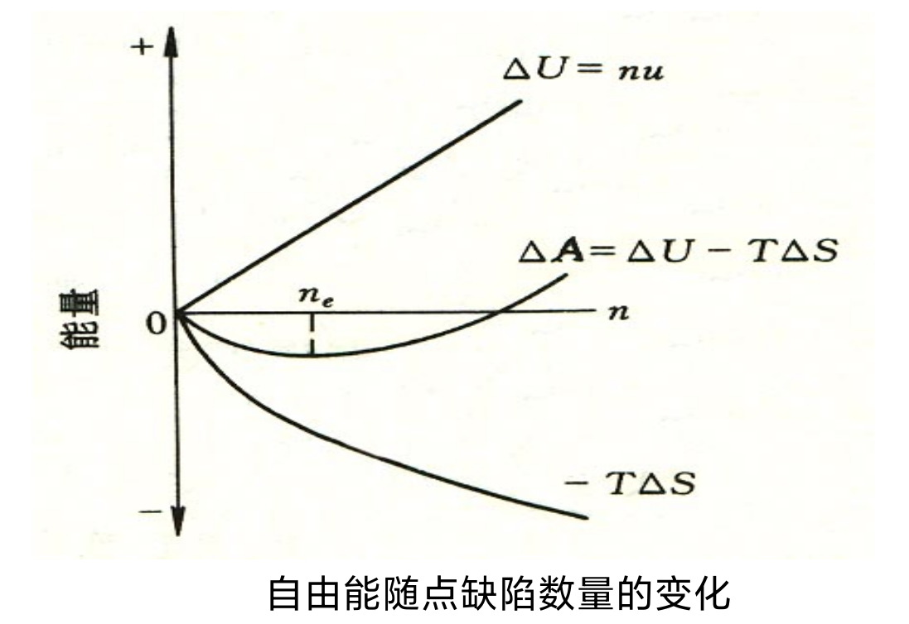
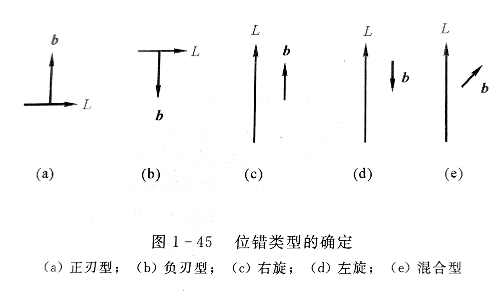

### 原子排列
#### 原子键合
- 金属键
	-  非方向键
	- 高配位数和密度
	- 导电率高
	- 延展性好
- 离子键
	- 非方向性
	- 高配位数
	- 低温不导电
	- 高温离子导电

### 晶体
#### 基本性质
- 自范性
- 各向异性`具有的一定是晶体，不具有某一异性的不一定就不是晶体`
- 均匀性`宏观上，各向异性在材料上均匀分布`
- 对称性
	- `理化性质在不同方向或位置上有规律的重复`
	- `旋转对称轴数1,2,3,4,6`
	- `按照晶体的晶系对称特征元素，划分出7个晶系`
- 稳定性
	- `具有最小的内能和最大的稳定性`
	- `具有固定的熔点`
多晶体的性质不仅取决于单晶体的结构和性质，而且与晶粒的形状、大小、取向、边界有关。

#### 粉末X衍射  I-$\theta$分布图像

| 晶体   | 非晶体 |
| ---- | --- |
| 明锐线条 | 漫峰  |
### 结构基元与阵点
空间排布上每隔相同距离重复出现的微粒称为**结构基元**.
构成晶体的微粒/结构基元的具体排列方式称为**晶体结构**或**晶体点阵**.

**晶体结构 = 结构基元 + 空间点阵**

空间点阵的性质
- 所有阵点都是等同的
- 阵点的排列具有周期性

#### 晶格与晶胞

任意空间点阵中任意两个阵点构成的矢量称为点阵矢量.
每个方向上连接相邻阵点的矢量称为该方向的基矢,长度称为周期.

能完全反应晶体特征（周期性和对称性）的最小几何单位,称为晶胞.
参数：
- 棱长a,b,c
- 3棱轴两两夹角$\alpha$,$\beta$,$\gamma$

晶胞的选取
- 代表整个空间点阵的周期性和对称性
- 相等的棱和角的数目最多
- 棱间直角最多
- 满足上述条件下，晶胞应具有最小的体积

两类晶胞
- 点阵晶胞
- 结构晶胞

晶格`空间点阵的全集`$\geq$ 晶胞`最小单位`

#### 晶向
- 不代表点阵中的具体位置
- 过一个阵点可以有无数个晶向
- 晶向上阵点的分布具有周期性
- 具有相同的周期性但是空间位向不同的晶向组成**晶向组**
##### 计算晶向与晶面指数
晶向指数`Miller指数`：
- 1）以晶胞的某一阵点为原点，三条棱边为坐标轴（x，y，z)，并以晶胞棱边的长度作为坐标轴的单位长度（a,b.c)。
- 2）过原点作一有向直线OP，使其平行于待标定的晶向AB。
- 3）在直线OP 上选取离原点最近一个结点的坐标（x，y，z）。
- 4）将上述坐标的比化为简单整数比，如x：y：z= u：v：w。把所得最小整数加上方括号，$[uvw]$即为AB晶向的晶向指数。如果其中某一数为负值，则将负号标注在该数的上方，如$[u\bar vw]$

**显然一个晶向或晶面指数不仅代表一个晶向或晶面，而是表示一组互相平行、位向相同的晶向或晶面**

原子排列相同，但是空间位向不同的所有晶向称为晶向族以\<uvw\>表示

晶面指数：
- 1）建立以晶轴为坐标轴的坐标系，令坐标原点不在待定晶面上，其他同Miller
- 2）找出待定晶面在三坐标轴上的截距x，y，z
- 3）取截距的倒数$\frac{1}{x},\frac{1}{y},\frac{1}{z}$
- 4）将这些倒数化成3个互质的整数h,k,l，使$\frac{1}{x}:\frac{1}{y}:\frac{1}{z}=h:k:l$
- 5）写成(hkl)，确定晶面指数

##### 六方晶系:四轴系法
- 晶面指数：(hkil)，其中i=-(h+k)
- 晶向指数：\[uvtw\]，其中t=-(u+v)$$\begin{cases}u=\frac{1}{3}(2U-V)\\v=\frac{1}{3}(2V-U)\\t=-(u+v)\\w=W\end{cases}$$
##### 晶面、晶向特性
在立方晶系中，指数相同的晶向和晶面必然垂直 *如\[111\]$\bot$(111)*
当晶向\[uvw\]位于或平行于某晶面(hkl)时，则必须满足hu+kv+lw=0

##### 晶面间距
低指数晶面间距大（原子排列紧密），高指数晶面间距小（原子排列稀疏）

部分点阵的密排面：
- 简单立方
- 体心立方
- 面心立方
立方晶系晶面间距的计算公式$$d_{(hkl)}=\frac{a/n}{\sqrt{h^2+k^2+l^2}}$$
- 简单立方n=1
- 面心立方当h,k,l不全为偶数或奇数时，n=2
- 对于体心立方，当h+k+l为奇数时，n=2

### 晶体结构及其几何特征
#### 常见的金属晶体结构
高对称性，高密度，简单的晶体结构
典型金属的点阵结构：
- 面心立方(fcc) Au,Ag,Cu,Al,$\gamma$-Fe,Ni,Pb,Pd,Pt
- 体心立方(bcc) 碱金属V,Nb,Ta,Cr,Mo,W,$\alpha$-Fe
- 密排六方(hcp)`严格意义上不存在密排六方结构，可以继续拆分` $\alpha$-Ti,Be,Zn,Mg,Cd,Li

有些金属具有多种晶体结构`铁，钛，锰，锡`
`锡有三种晶体结构——白锡，灰锡，脆锡` *`锡与硫的化合物——硫化锡，颜色与金子相似，常用作金色涂料`*
- `白锡为四方晶系，延展性好`
- `灰锡为金刚石形立方晶系`
- `脆锡为正交晶系`*锡疫*

#### 晶胞内原子数
$n_i是晶胞内，n_f是面上，n_r是角上，m是晶体类型参数$
$$n=n_i+n_f/2+n_r/m$$
#### 点阵常数
把原子看作大小相同半径为R的球体，可以求出点阵常数与原子半径之间的关系

| 体心立方                     | 面心立方                    | 密排六方$(\frac{c}{a}=1.633)$ |
|:------------------------:|:-----------------------:|:-------------------------:|
| $R=\frac{\sqrt{3}}{4}a$  | $R=\frac{\sqrt{2}}{4}a$ | $R=\frac{1}{2}a$          |
| $a=\frac{4\sqrt{3}}{3}R$ | $a=2\sqrt{2}R$          | $a=2R$                    |

#### 晶体原子排列的紧密程度
##### 配位数 CN`CN越大，晶体排列越紧密`
每个原子周围最近邻且等距离的原子数目
体心立方CN=8，面心立方、密排六方CN=12
##### 致密度 k`k越大，，晶体排列越紧密`
单位晶胞中原子所占体积与晶胞体积之比
$$k=\frac{nv}{V}$$
体心立方k=0.68，面心立方、密排六方k=0.74
#### 晶体间隙
常见金属晶体结构中的间隙形状分为
- 四面体间隙`三球体`
- 八面体间隙`四球体`

间隙大小通常用间隙半径与钢球半径的比值$r_B/r_A$表示

晶体中原子的堆垛方式

晶体结构的多晶型性`同质多晶，同素异构`
产生的每一种化学组成相同但结构不同的晶体称为**变体**
`用于热处理`

### 晶体缺陷
 - 点缺陷
 - 面缺陷
 - 体缺陷

- 热缺陷
- 杂质缺陷（非本征缺陷）
- 非化学计量缺陷（非整比化合物）
- `电荷缺陷、辐照缺陷`

#### 点缺陷`零维缺陷`
- 空位
	- 肖脱基`由于热振动等原因脱离平衡位置，如晶界、相界，在原来的格点留下了空位.` 由于空位的存在，使周围的原子偏离平衡位置，形成晶格畸变
	- 弗兰克尔`由于热振动等脱离平衡位置，跑到邻近的原子空隙形成自间隙原子，在原来格点处留下空位.` 形成**间隙原子-空位对**.`金属中少见，离子电性差距较大`
- 间隙原子
	- 自间隙原子`弗兰克尔缺陷形成`
	- 异类间隙原子
- 置换原子`异类原子占据了晶体点阵中原先基体原子的平衡位置`
	- 大
	- 小

平衡点缺陷
热振动->能量起伏->原子能量升高->脱离周围原子约束`动态平衡，与温度有关`

过饱和点缺陷
由高温淬火、辐照、冷加工等外来作用产生.`非平衡、不稳定`

点阵畸变意味着原子离开平衡位置，形成应力场，使晶体内能升高.通常把升高的这部分能量称为点缺陷形成能.

形成自间歇原子的能量是形成空位的几倍.

点缺陷不是静止的，不断产生与迁移
- 复合`浓度降低`
- 聚集`浓度升高，形成空位片，产生塌陷`

晶体中点缺陷的存在，在热力学上产生了两个相互矛盾的作用：
- 一方面，造成点阵畸变，使晶体的内能升高，从而增大了晶体的热力学不稳定性；
- 另一方面，由于增大了原子排列的混乱程度，并改变了其周围原子的振动频率，使得晶体的熵值增大。而熵值越大，晶体越稳定。

由于存在着这两个相互矛盾的因素，因而晶体中的点缺陷在一定温度下有一定的平衡数目，这时点缺陷的浓度就称为它们在该温度下的**热力学平衡浓度**.

**在一定温度下有一定的热力学平衡浓度**，这是点缺陷区别于其他类型晶体缺陷的重要特点.

**具有平衡点缺陷的晶体在热力学上比理想晶体更加稳定.**

$$\begin{aligned}c_v&=\frac{n_e}{N} \\&=\exp[-\frac{\Delta E_V}{kT}+\frac{\Delta S_V}{k}]\\ &=A\exp(-\frac{\Delta E_V}{kT})\end{aligned}$$
式中$A=\exp(\frac{\Delta S_V}{k})$ 
$\boxed{\begin{aligned}n_e:&平衡空位的数目\\ N:&阵点总数\\ \Delta E_V:&形成能（每增加一个空位的能量变化）\\ \Delta S_V:&相应的振动熵变化\\ k:&波尔兹曼常数\end{aligned}}$

##### 点缺陷对晶体性能的影响
- 结构变化：晶格畸变
	- 空位：晶格收缩
	- 间隙原子：晶格膨胀
	- 置换原子：晶格收缩或膨胀
- 性能变化
	- 物理性能：电阻率增大；密度减小
	- 力学性能：间隙原子、置换原子产生固溶强化效果，过饱和点缺陷（淬火空位、辐照缺陷）可以提高屈服强度
- 工艺过程
	- 高温时点缺陷浓度急剧增大，对晶体材料的工艺处理过程如扩散、高温塑形变形和断裂、退火、表面化学热处理等具有极大影响.

#### 线缺陷
定义
- 细长管状畸变区域，长度达到几百至几万个原子间距，宽度仅为几个原子间距
- 晶体中点阵发生畸变的线性微区
- 已滑移区和未滑移区之间的边界
位错线
- 已滑移区和未滑移区在滑移面上的交界线`不可能是一条几何上的“线”，是一个过渡区`

理论临界剪切应力$\tau_m$为$$\tau_m\approx\frac{Gb}{2\pi a}\approx\frac{G}{2\pi}$$
式中G为切变模量.

类型：
- 刃型位错 *多余半原子面位于晶体上半部的位错线称为正刃型位错，用$\bot$表示，反之为负刃型位错.滑移面上部位错线周围原子受压应力作用，原子间距小于正常晶格间距*
- 螺型位错 *水平旋转，有左旋右旋之分，有本质区别*
- 混合型位错 *位错线与滑移方向既不垂直也不平行*

位错的性质
- 不是几何直线，位错及畸变区是一条管道
- 是已滑移区和未滑移区的边界
- 不能中断于晶体内部，可在表面露头，或终止于晶界和相界，或与其他位错相交，或自行封闭成环

#### 柏氏矢量
定义
- 人为设定位错线的正方向`离开纸面为正`
- 在位错周围以右手螺旋沿着点阵结点形成封闭回路：柏氏回路（避开严重畸变区）
- 在完整晶体中按照相同步骤作矢量，起点终点必不闭合，由终点指向起点的矢量**b**就是**该位错柏氏矢量**.
- 刃型位错的柏氏矢量与位错线相互垂直
- 螺型位错的柏氏矢量与位错线平行

表示方法
柏氏矢量的方向可以用晶向指数表示，大小称为位错强度，可以用其模表示.柏氏矢量的模表示了该方向上原子间的距离.

如果模等于该晶向上原子的间距，称此位错为全位错或单位位错；如果模小于该晶向上原子的间距，则称为不全位错.
$$\vec{b}=\frac{a}{n}[uvw]$$

$\vec{b}$是位错周围晶体弹性变形的叠加.$\vec{b}$越大，弹性性能越高.

## 固溶体
组元
- 组成材料最基本、独立的物质.
- 组元可以是纯元素（金属或非金属）也可以是化合物；
- 材料可以是单组元的，也可以由多组元组成.
##### 相
- `热力学定义`在任一给定的物质系统中，具有同一化学成分、同一原子聚集状态和性质的均匀连续组成部分.
- `材料学定义`材料中具有同一聚集状态，同一晶体结构和性质，并以界面隔开的均匀连续组成部分.或者，材料中结构相同、成分和性能均一的组成部分.
- 材料有单相的，也有两相、多相.
- 一个相可以是单组元的，也可以是多组元的.

固体中的相包括：
- 固溶体
- 化合物
- 陶瓷晶体相
- 玻璃相
- 分子相

合金中的相：
- 固溶体
- 金属间化合物（中间相）

固溶体
- 固态下一种组元（溶质）溶解在另一种组元（溶剂）中形成的新相.
- 固溶度`极限溶解度，通常用摩尔分数表示`溶质原子在溶剂中的最大含量.
固溶体的特点：
- 固溶体具有溶剂组元的点阵类型，晶格常数稍有变化.
- 有一定的成分范围，也就是说，组元的含量可在一定范围内改变而不会改变固溶体点阵类型的改变.由于固溶体的成分范围是可变的，而且有一个溶解度极限，故通常固溶体不能用一个化学式表示.
- 金属固溶体具有比较明显的金属性质，固溶体中的结合键主要是金属键.
固溶体分类：
- 置换固溶体
- 间隙固溶体

- 有限固溶体`端际固溶体`
- 无限固溶体`连续固溶体`
只有置换固溶体才有可能是无限固溶体.

- 有序固溶体`超结构、超点阵，有规律的占据溶剂结构中的固定位置，而且溶剂与溶质原子之比一定.`
- 无序固溶体

有限置换固溶体*Cu-Zn、Cu-Ti、Fe-W、Fe-Mo*
无限置换固溶体*Ni-Cu、Au-Ag、Fe-Cr、Fe-Ni、Fe-Co、Fe-V*

若组元晶体结构不同，晶格与固溶体相同的组元为溶剂；
若结构相同，则摩尔分数大于50%的组元是溶剂.

绝大部分金属元素之间都能形成置换固溶体，但是只有少部分金属元素之间可以形成无限固溶体
- 只有0价或1价的元素相互溶解有可能形成无限固溶体