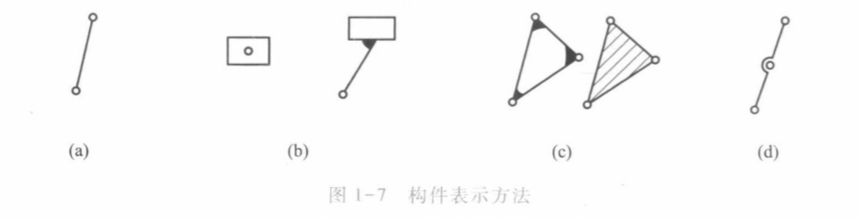

## 绪论
用来传递运动和力、有一个构件为机架、用构件间能够相对运动的连接方式组成的构件系统称为机构
常用的机构包括**连杆机构、凸轮机构、齿轮机构、轮系及间歇运动机构等**

机构与机械的区别在于：**机构只是一个构件系统，而机器除构件系统外，还包括电气、液压等其他装置；机构只用于传递运动和力，而机器还具有变换或传递能量、物料、信息的功能。在研究受力时，可以认为无区别**

就功能而言，一般机器包含四个基本组成部分：
- 动力部分
- 传动部分
- 控制部分
- 执行部分

机构的一些分类
- 连杆机构`全是低副`
	优点：
	- 由于是低副面接触，承受压强小，便于润滑、磨损较轻，课承受较大载荷； 结构简单，加工方便，构件之间的接触是有构件本身的几何约束来保持，所以构件工作可靠； 改变构件长度，实现多种运动形式，满足多种运动规律的要求
	缺点：
	- 运动复杂
- 铰链四杆机构`运动副都是转动副`
- 串联机构`构件依次串联，最后一个构件只有一个运动副`（开链）
- 并联机构`动静平台是通过多个支链连接的机构`（闭链）

构件是运动的单元。可以是单一的整体，也可以是由几个零件组成的刚性结构。

## 平面机构的自由度和速度分析
所有构件都在相互平行的平面内运动的机构称为**平面机构**，否则称为**空间机构**
构件相对于参考系的独立运动的数目称为**自由度**.一个做平面运动的自由构件具有三个自由度.

两构件直接接触并能产生一定相对运动的连接称为运动副.构件组成运动副后，其独立运动受到约束，自由度随之减少.

按照接触的特性，通常把运动副分为**低副**和**高副**.
- 低副`两构件通过面接触组成的运动副称为低副`
	- 转动副`铰链`
	- 移动副`滑块`
- 高副`通过点或线接触形成的运动副称为高副`
	- 车轮与钢轨、凸轮与动件、齿轮等`沿接触处公切线方向的相对移动和在平面内的相对转动`

除以上平面运动副外，还有球面副和螺旋副等.

#### 简图画法
- **圆圈**表示转动副
- 在机架构件上加**阴影线**
- 组成高副时，应当画出接触处的**曲线轮廓**
- 在角处画**焊接符号**，表明是一个刚性整体
- 在几何体的角标上**焊接符号**或标上**阴影线**表示几何体是一个刚性整体

机构中的构件可分为三类：
- 固定构件（机架）`用来支撑活动构件的构件`
- 原动件（主动件）`运动规律已知的活动构件`
- 从动件

### 自由度
每个低副引入两个约束，使构件失去两个自由度
每个高副引入一个约束，使构件失去一个自由度

设某平面机构共有K个构件，除去固定构件，则活动构件数为$n=K-1$.
机构的自由度表示为F，则$$F=3n-2P_L-P_H$$
机构的自由度取决于**活动构件的个数**以及**运动副的性质和个数**.

机构的原动件的独立运动是由外界给定的.如果给出的原动件数不等于机构自由度，将会发生以下问题：
- 原动件数小于机构的自由度`机构不具有确定的相对运动`
- 原动件数大于机构的自由度`机构中最弱的构件会损坏`

综上所述，机构具有确定运动的条件是：**机构自由度$F>0$,且F等于原动件数.**

计算自由度的注意事项
- 1）复合铰链`K个构件汇交而成的复合铰链有(K-1)个转动副`
- 2）局部自由度`(多余自由度)与输出构件运动无关的自由度` 局部自由度虽然不影响整个机构的运动，但有减少磨损等作用
- 3）虚约束`有些约束对机构自由度的影响是重复的，对机构运动不起任何限制作用.虚约束维护构件间几何尺寸`
	- 两构件之间组成导路**方向平行**的多个**移动副**，只有一个移动副起约束作用
	- 两构件之间组成多个**轴线重合**的**转动副**时，只有一个转动副起约束作用
	- 机构中传递运动不起独立作用的对称部分
	- `虚约束要求比较高的制造精度，如果加工误差太大，虚约束不能满足特殊几何条件，虚约束就会变成实际约束，阻碍构件运动`
## 速度瞬心
瞬心数$N=\frac{K(K-1)}{2}$

三心定理：作相对平面运动的三个构件共有三个瞬心，这三个瞬心位于同一直线上

铰链四连杆机构
曲柄`整周匀速运动`*偏心轮等*，一般是主动.
摇杆`部分变速运动`缝纫机的摇杆是主动的.
- 曲柄摇杆
- 双曲柄`一主动一从动，一匀速一变速`
- 双摇杆

$e\neq 0$时，有急回.
偏心轮曲柄短时，轴径尺寸大，强度高，刚度高，便于加工制造.