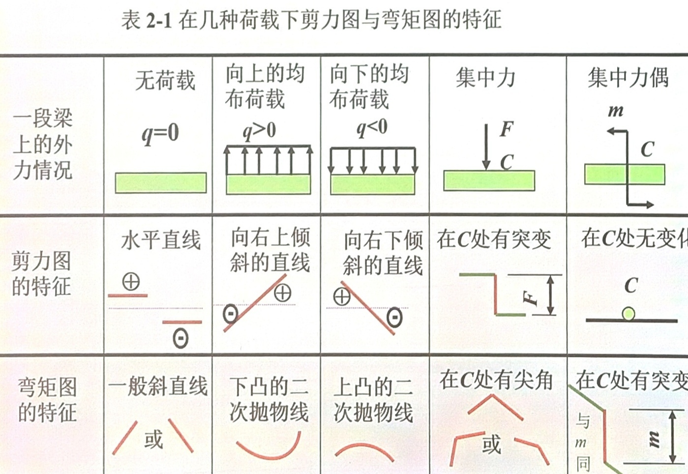
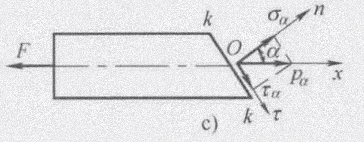

### 基本假设
- 连续性假设
- 均匀性假设
- 各向同性假设
- 小变形假设

### 外力
按照作用方式分类：
- 体积力
- 表面力
	- 集中力
	- 分布力

按照与时间的关系分类：
- 静载荷
- 动载荷
	- 交变载荷
	- 冲击载荷

### 内力

### 应力
应力从单位上看，不是力。`去除了力的大小对几何尺寸的依赖（截面面积越大，截面总力越大）`
``因此某种程度上可以认为p（压强）等比值定义的量可以认为是某点的该物理量大小``
- 平均应力$$p_M=\frac{\Delta F}{\Delta A}$$
- 一点的应力（全应力）$$p=\lim\limits_{\Delta A\rightarrow 0}\frac{\Delta F}{\Delta A}=\frac{\rm dF}{\rm dA}$$
通常把应力**p**分解成切向分量 $\tau$ `切应力`和法向分量 $\sigma$ `正应力`.

应力描述物体强度.

#### 一般（空间）的应力状态
微元体体积无穷小，相对面上的应力**等值、反向、共线**.

### 变形、位移和应变
- 变形（deformation）`在外力作用下物体形状和尺寸发生改变`
- 位移（displacement）`变形前后物体内一点位置的变化`
- 应变（strain）`度量构件一点处的变形程度`
	- 正应变`线应变`(normal strain) $$\epsilon=\lim\limits_{\Delta s\rightarrow0}\frac{\Delta u}{\Delta s}=\frac{\rm du}{\rm ds}$$
	- 切应变`剪应变、角应变`（shearing strain）`单位体相邻棱边所夹直角的改变量` 用$\gamma$表示

$\epsilon$描述尺寸的改变，$\gamma$描述形状的改变.

应变量描述物体刚性.

### 胡克定律
$$\sigma=E\varepsilon$$
`E称为弹性模量（杨氏模量）`
$$\tau=G\gamma$$`G称为切变模量（剪切弹性模量）`

### 杆件变形的基本形式
- 轴向拉伸和压缩（axial tension and compression）`力沿轴线`
- 剪切（shear）`大小相等，指向相反，作用线距离很近`
- 扭转（torsion）`垂直于杆件轴线施加一对力偶`
- 弯曲（bending）`在包含杆件的纵向平面内作用一对等大反向的力偶`
还有组合变形

### 截面法
- 1）截`在所求截面处截平面`
- 2）取`取一部分作为研究对象`
- 3）代
- 4）平

若轴力的指向背离截面，则规定为正，称为**拉力**(tensile force)
若轴力的指向指向截面，则规定为负，称为**压力**(compressive force)
轴力图：画出$F_N-x$图像

从已知出发，按照方法列方程

### 扭转
$$M_e\ \omega=M_e\times\frac{2\pi n}{60}=P\rm(kW)$$
$$M_e=9549\frac{P}{n}\rm(N\cdot m)$$
### 弯曲
直杆受的外力是垂直于轴的平衡力系，变形后杆轴变为曲线，这种变形称为弯曲.

以弯曲为主要变形的直杆称为**梁**.

当梁上所有外力均作用在纵向对称面内时，这种弯曲称为**对称弯曲**.

支座约束力可以根据静力平衡方程求出的梁称为静定梁.
- 简支梁`一端为固定铰支座，一端为可动铰支座`
- 悬臂梁`一端为固定端约束，一端自由`
- 外伸梁`固定铰支座和可动铰支座不在梁端`
梁在两支座之间的部分称为**跨**，其长度称为梁的**跨长**.悬臂梁的跨长是固定端到自由端的距离.

#### 剪力和弯矩
若剪力使$\rm dx$微端的左端对右端向上相对错动，则截面上的剪力为正；反之为负.

#### 剪力方程与弯矩方程
$$F_s=F_s(x),\quad M=M(x)$$
分段画图

若载荷为集中力或集中力偶，则图中有突变，x取值不能等于突变点

$$\frac{{\rm d}F_s(x)}{{\rm d}x}=q(x),\quad \frac{{\rm d}M(x)}{{\rm dx}}=F_s(x),\quad \frac{{\rm d^2}M(x)}{{\rm d}x^2}=q(x)$$
## 杆件的应力与强度计算
$$F_N=\int_{A}\!\sigma{\rm d}A=\sigma\!\int_{A}{\rm d}A=\sigma\!A$$
$$\sigma=\frac{F}{A},\quad\sigma_\max=\frac{F_\max}{A}$$
当截面为斜面时，内力并没有因此加大.
$$P_\alpha=\frac{F}{A}\cos\alpha=\sigma\cos^2\alpha$$
把应力$p_\alpha$分解成垂直于斜截面的正应力$\sigma_\alpha$和切于斜截面的切应力$\tau_\alpha$.
$$\begin{aligned}&\sigma_\alpha=p_\alpha\cos\alpha=\sigma\cos^2\alpha\\&\tau_\alpha=p_\alpha\sin\alpha=\sigma\cos\alpha\sin\alpha=\frac{\sigma}{2}\sin2\alpha\end{aligned}$$

规定正应力为拉应力，切应力以$\vec{n}$顺时针旋转$90^\circ$的指向为正.
### 材料在拉伸与压缩时的力学性能
### 失效、许用应力与强度条件
### 圆轴扭转时的切应力与强度条件

**！！！基于平面假设！！！**
有扭转角$\varphi$，倾角`切应变`$\gamma$，单位长度扭转角$\frac{{\rm d}\varphi}{{\rm d}x}$
#### 物理关系
由剪切胡克定律有$$\tau_\rho=G\gamma_\rho=G\rho\frac{{\rm d}\varphi}{{\rm d}x}$$
#### 静力学关系
有截面扭矩$$T=\int_A\rho\tau_\rho{\rm d}A=G\frac{{\rm d}\varphi}{{\rm d}x}\int_A\rho^2{\rm d}A$$
若令横截面对圆心的极惯性矩$$I_p=\int_A\rho^2{\rm d}A$$
则$$\frac{{\rm d}\varphi}{{\rm d}x}=\frac{T}{GI_p}$$
回代则有$$\tau_\rho=\frac{T\rho}{I_p}$$
令扭转截面系数$W_p=I_p/R$，则$$\tau_\max=\frac{T}{W_p}$$
*只适用于横截面不变的 空心/实心 直圆轴，可适用缓慢变化的小锥度杆*

### 梁弯曲时的正应力
### 轴向拉伸或压缩时的变形
$$\Delta l=\frac{FL}{EA}$$
其中EA称为抗拉（压）刚度.

$$\vert\frac{\varepsilon^\prime}{\varepsilon}\vert=v$$
横向正应变与轴向正应变有$$\varepsilon^\prime=-v\varepsilon$$
其中v称为横向变形因数或**泊松比**，无量纲.对于绝大多数各向同性材料，$0<v<0.5$

$$G=\frac{E}{2(1+v)}$$
### 扭转变形与刚度条件
若扭矩不变$$\varphi=\frac{Tl}{GI_p}$$
其中$GI_p$称为抗扭刚度.

对薄壁圆筒有$$\varphi=\frac{Tl}{2G\pi R^3_0t}$$
求关于x的$\varphi$的导数，得到单位长度扭转角$$\varphi^\prime=\frac{T}{GI_p}$$
### 梁的变形，挠曲线微分方程及其积分
